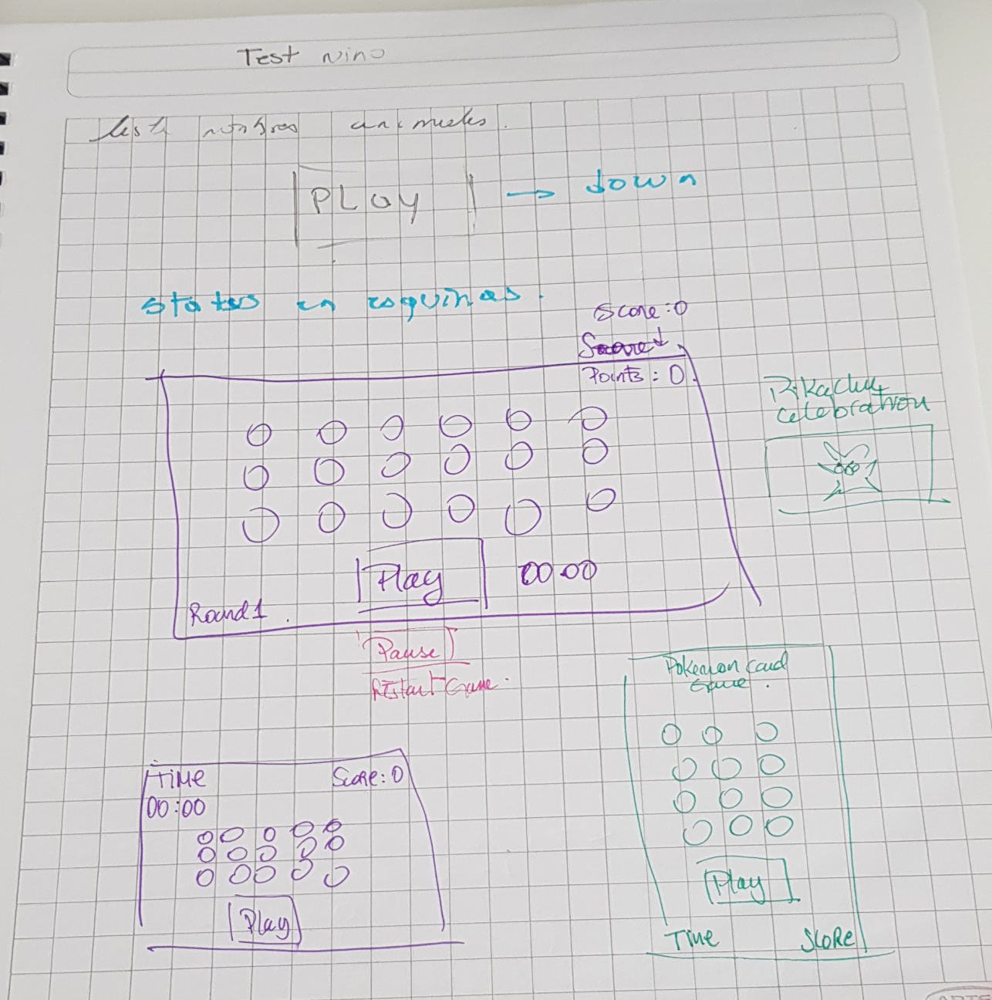
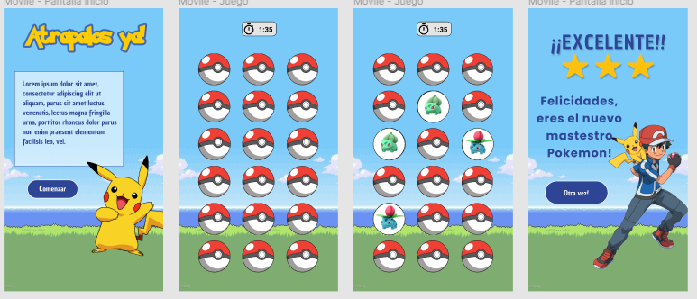
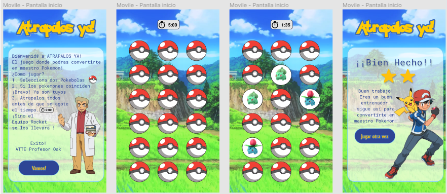
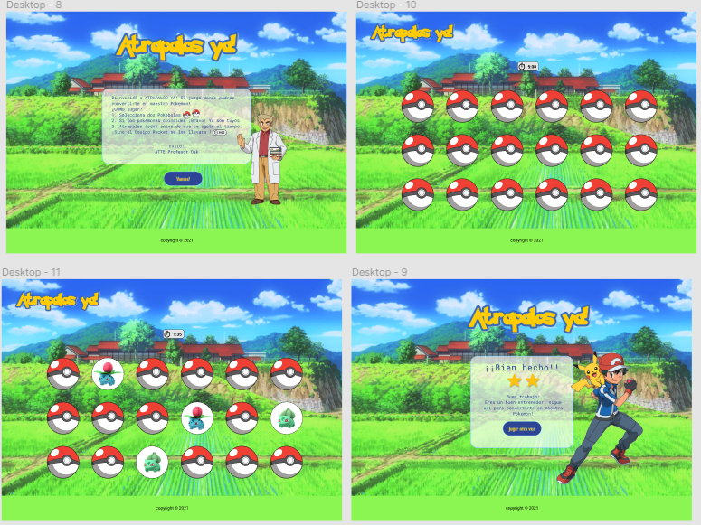

# Memory Match Game - Atrapalos ya!

Project: Pokemon Memory Match Game
Developers:
Karin Escobar
Alejandra Olea
Credits: Images Unsplash (free).

_La interfaz de la aplicación será desplegada usando GitHub Pages._

## Índice

* [1. Resumen del proyecto](#1-resumen-del-proyecto)
* [2. Detales del proyecto](#2-detalles-del-proyecto)
* [3. Definicion del producto](#3-definicion-del-producto)
* [4. Investigacion de usuaries](#4-investigacion-de-usuaries)
* [5. Prototipo](#5-prototipo)

## 1. Resumen del proyecto

En este proyecto se construye una versión web del juego Memory Match, en la que una jugadora pueda jugar sola, en el navegador. Es un juego en el que las cartas se dan la vuelta de a dos en cada turno. El objetivo del juego es destapar parejas de cartas que coincidan.
El proyecto requiere UX/UI investigación y consecuente iteration, el construir historias de usuarios y uun user customer. El prototipado se realizo en etapas: bosquejos en papel y prototipos de baja fidelidad que fueron evolucionaando a alta fidelidad como resultados proceso de investigaciónn en interacción con usuarios. Una fase importante fue la priorizacion de las features a incluir en el hacking vs/tiempo dentro del scope del proyecto. Para ver la información completa del procesao UX/UI y el grafico de prioritización, favor visitar la presentación en [Miro.](https://miro.com/app/board/o9J_lS32vAA=/)

## 2. Detalles del proyecto

Objetivo de aprendizaje: Diseñar y construir una interfaz web basada en data e interacción con la usuaria.
HTML y CSS, DOM, JavaScript, Testeo unitario, estructura del código y guía de estilo, Git y GitHub, UX/UI.

## 3. Definicion del producto

Atrapalos ya! es un juego de cartas de memorice con imagenes del clasico videojuego Pokemon, en el cual, las cartas se dan la vuelta de a dos cartas en cada turno.Son iguales? Genial! ya son tuyas! Continua destapando cartas hasta encontrar todos los pares de Pokemones.Una vez destapadas todas las cartas el usuario recibe un mensaje con su nivel de performance de acuerdo a cuanto se demoro en encontrar los pares.
Ten cuidado! Si se te acaba el tiempo antes de encontrar todos los Pokemones, el equipo Rocket se los llevara.

## 4. Investigacion de usuaries

Primer approach: Investigacion en la web.

a.- Quiénes son los usuarios?

Personas que buscan entretención. 
Niñes y jovenes que busquen desafiar su memoria con un divertido Juego.
Fanaticos de Pokemon
Jovenes y adultes atraidos por a nostalgia de revivir este clasico juego de su infancia.
Mas sobre el perfil del usuario en [Miro board.](https://miro.com/app/board/o9J_lS32vAA=/)

b.- Objetivos en relación con el producto?

Engagament, Adoption, conversion.

c.-Cómo el producto soluciona los problemas/necesidades de dichos usuarios.

Es un juego que proporciona entretención y ayuda a ejercitar la memoria.

## 5. Prototipo
Primer borrador de prototipo en papel 

Primer diseño de prototipo, este fue mostrado a nuestros usuaries para obtener feedback.

### Feedback de usuario

Se entrevisto a un tota de 8 usuaries, de diversos generos, y edades entre 7 y 35 años.
Sus principales feedbacks y los que mas se repetian fueron los siguientes:

* "Me gusta el uso de pokebolas, le da una mejor identidad a que solo sean cartas"
* "Algunos elementos, como la tipografia, colores y las pokebolas, son de la primera generacion de pokemon, pero el fondo no, me gustaria mas un fondo mas acorde a la historia"
* "Incluir al equipo Rocket seria bueno, son un clasico!"
* "Me gustaria un sistema de puntos, para saber que tan bien lo hice"
* "5 minutos es mucho tiempo, me gustaria algo mas desafiante"
* "Podrian agregar musica de suspenso! como cuando se atrapan las pokebolas o e del clasico GameBoy"

### Diseño de la Interfaz de Usuario

Gracias al feedback de nuestros usuarios, pudimos inclinarnos a una tematica y diseño mas enfocados en a estetica de Pokemon primera generacion, donde los elementos son mas vivos y coloridos (Ash vive en una isla con mucho bosque, y no conoce el mar hasta la segunda generacion!), se eligio un fondo acorde a estas especificaciones o con ayuda de nuestros usuaries elegimos nuevos elementos. Tambien optamos por dar una bienvenida con el clasico profesor Oak quien entregue las instrucciones.
Se incorporo el sistema de turnos , siendo cada turno el dar vuelta un par de cartas (sea o no sea par), y en base a estos se realizaron distintos niveles al ganar el juego, para poder dejar al usuario con ganas de superarse. Entre en menos turnos encuentres todos, mejor! En la pantalla de resultados aparece Ash junto a Pikachu felicitando al jugador por su logro.
Cambiamos tambien el tiempo de juego de 5 min a 2 min. Esto ya que en promedio era lo maximo que se demoraban en resolver el juego, sobretodo los usuarios mas pequeños. Si el tiempo de juego se agota, y no haz logrado conseguir todas las cartas, el equipo Rocket junto a Meowth apareceran para llevarse todos los Pokemones :(
Pero no se preocupen! Siempre se puede intentar nuevamente.

[Aca puedes ver a uno de nuestros usuarios experimentando los primeros avances del juego!.](https://www.loom.com/share/b14d4b0a6e9d4af3aadc47fcc53c8041?sharedAppSource=personal_library)

#### Prototipo de alta fidelidad

Gracias a la investgacion de la tematica escogida y el feedback de nuestros usuaries, desarrollamos finalmente nuestro prototipo fina de intefaz 

Prototipo para movil

Prototipo para escritorio

